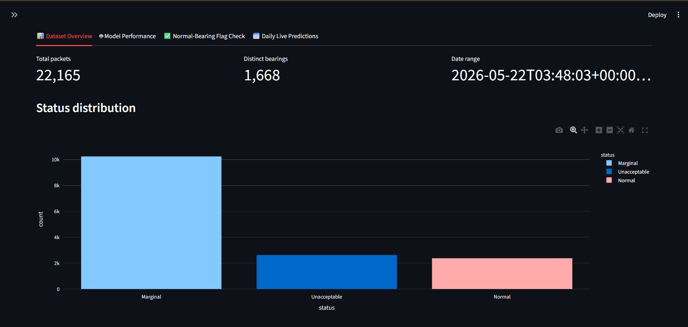
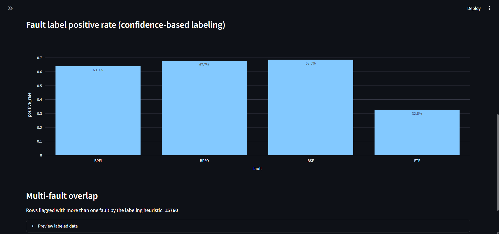
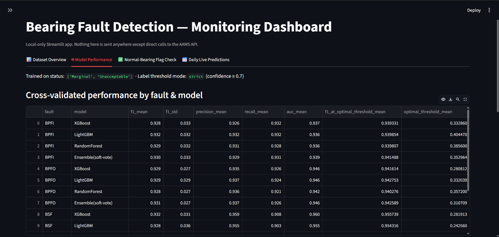
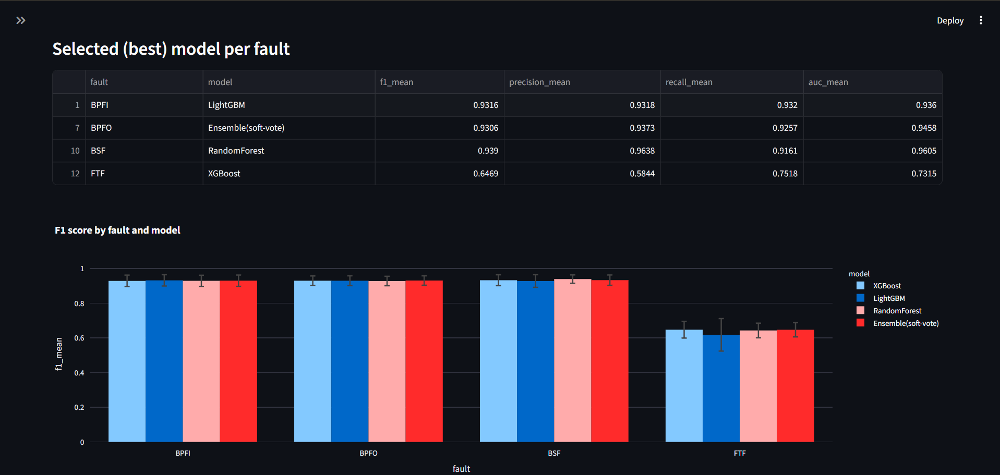
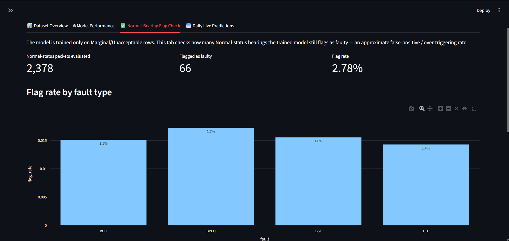
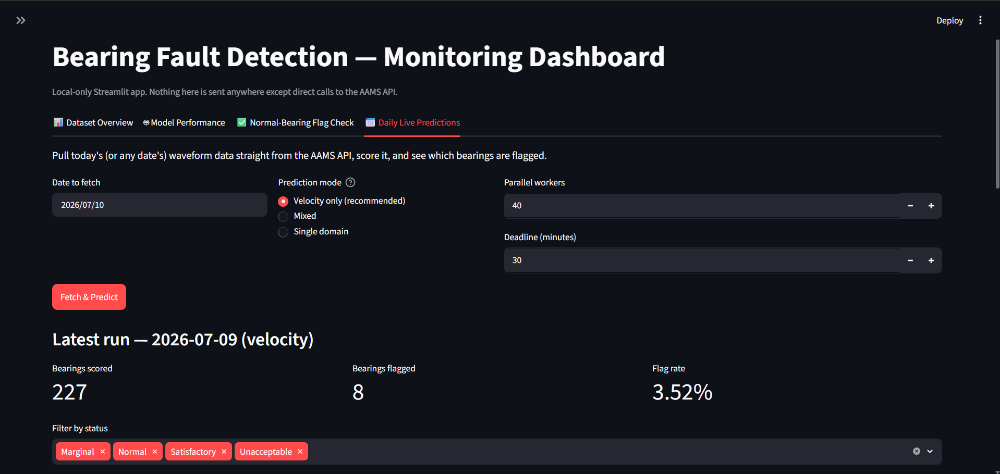
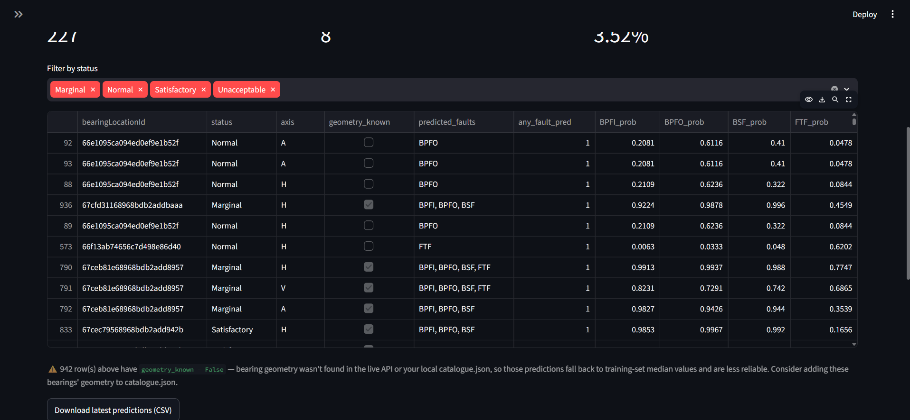

# Bearing Fault Detection

This project takes raw vibration waveforms from bearings, turns them into engineered
features, labels them using a physics-based confidence score (harmonics, sidebands,
SNR against the bearing's known fault frequencies), and trains classifiers for four
fault types: BPFI, BPFO, BSF, and FTF. It also handles daily scoring against the live
AAMS API and ships with a local Streamlit dashboard to look at all of it.

The short version of where things stand: velocity is the primary signal used for daily
predictions (per current guidance), acceleration is still trained and available for
comparison, and there's a mixed-domain option that routes each fault to whichever
domain actually performs better for it, in case that's useful later.

## Pipeline at a glance


Training and daily prediction are two separate entry points, but they run through the
exact same feature extraction and labeling code, so there's no risk of the two paths
quietly drifting apart from each other.

## Dataset overview





## Screenshots

Markdown only shows an image if there's an actual `` line pointing at a
file that exists — nothing here updates itself automatically, so the naming below is
fixed on purpose. Save your screenshots using these exact names (numbered 1, 2, 3) and
they'll show up in the relevant section further down this file. Fewer than 3 is fine —
an image tag pointing at a file that doesn't exist yet just won't render, no error.

```
docs/images/
├── overview/
│   ├── 1.png
│   ├── 2.png
│   └── 3.png
├── model-performance/
│   ├── 1.png
│   ├── 2.png
│   └── 3.png
├── normal-flag-check/
│   ├── 1.png
│   ├── 2.png
│   └── 3.png
└── daily-predictions/
    ├── 1.png
    ├── 2.png
    └── 3.png
```

To capture them: run `streamlit run dashboard/app.py`, click through each tab, save a
screenshot into the matching folder using the numbers above, commit. If you want more
than 3 per tab, add `4.png` etc. to the folder and add a matching `` line next
to the others in that section.

## Project structure

```
bearing_fault_detection/
├── config.py                   # paths, API creds, labeling/feature constants, domain switching
├── requirements.txt
├── .env                        # your AAMS credentials (not committed — see .env.example)
├── data/
│   ├── raw/                    # historical data: YYYY-MM-DD/ folders + catalogue.json
│   └── live/                   # daily API pulls land here, same layout as data/raw/
├── src/
│   ├── feature_extraction.py   # time/frequency/envelope-spectrum feature computation
│   ├── build_dataset.py        # raw JSON -> waveform.csv, shared by training and daily prediction
│   ├── labeling.py             # fault frequencies, confidence scoring, binary labels
│   ├── train.py                # StratifiedGroupKFold CV, hyperparameter search, SMOTETomek
│   ├── evaluate_normal.py      # false-positive check against held-out Normal bearings
│   ├── api_client.py           # pooled-connection AAMS API wrapper
│   ├── fetch_live_data.py      # saves live API data to disk + merges with local catalogue
│   ├── predict_daily.py        # daily fetch + build + score
│   └── predict_utils.py        # model loading, prediction, the mixed-domain ensemble class
├── dashboard/
│   └── app.py                  # Streamlit dashboard, local only
├── models/                     # acceleration models (train.py output)
├── models_velocity/            # velocity models (train.py --domain velocity output)
├── outputs/                    # generated CSVs — features, labels, CV results, predictions
└── scripts_dev/
    └── gen_synthetic.py        # fake data generator for smoke-testing, not for real use
```

## Setup

```bash
cd bearing_fault_detection
python -m venv venv && source venv/bin/activate
pip install -r requirements.txt
```

Copy `.env.example` to `.env` and fill in your real values:

```
AAMS_EMAIL=your-ml-service-account@email.com
AAMS_PASSWORD=your-password
```

`config.py` loads this automatically (`python-dotenv`) — you don't need to export
anything manually. `.env` is in `.gitignore`; only `.env.example` (with placeholder
values) is meant to be committed.

If your historical data lives somewhere other than `data/raw/`, point at it either in
`config.py` or via environment variables:

```bash
export BFD_RAW_DATA_ROOT="/path/to/your/date-folders"
export BFD_CATALOGUE_PATH="/path/to/your/date-folders/catalogue.json"
```

Your data folder should look like:

```
data/raw/
├── 2026-05-22/
│   ├── <bearingLocationId>.json
│   └── ...
├── 2026-05-25/
├── ...
└── catalogue.json
```

Each waveform file has a top-level `bearingLocationId`, `date`, `status`, and a
`packets` list — each packet carrying `samples`, `sampling_rate`/`sr`, `axis`, and so
on. Both the live API's camelCase field names and local snake_case names are handled
(`normalize_packet()` in `feature_extraction.py`), so files from either source work
without modification.

`catalogue.json` is the bearing metadata list — `machineRpm`, `innerRacePass`,
`outerRacePass`, `rollElementPass`, `cageRotation`, etc. — keyed by `bearingLocationId`.

## Running the training pipeline

```bash
# velocity — this is what actually gets used for daily predictions
python -m src.build_dataset --domain velocity
python -m src.labeling --domain velocity
python -m src.train --domain velocity
python -m src.evaluate_normal --domain velocity

# acceleration — kept around for comparison, not used daily right now
python -m src.build_dataset
python -m src.labeling
python -m src.train
python -m src.evaluate_normal
```

Then, whenever you want:

```bash
streamlit run dashboard/app.py
```

## How labeling works

For every packet:

1. `shaft_frequency = machineRpm / 60`
2. `BPFI / BPFO / BSF / FTF (Hz) = catalogue multiplier × shaft_frequency`
3. Check the packet's spectrum for:
   - harmonics — peaks near 1×, 2×, 3×, 4× the fault frequency (±3% by default)
   - sidebands — peaks near `fault_freq ± k × shaft_freq` for k = 1, 2
   - local SNR — the strongest matched harmonic against the median amplitude of
     everything else nearby
4. Those three combine into a confidence score, weighted 0.5 / 0.3 / 0.2, and get
   knocked down hard if the SNR gate or the harmonic-count check fails.
5. Confidence above the threshold (currently strict, 0.70) becomes a positive label.

This lives in `src/labeling.py`. There's a `--label-mode` flag (`strict` / `balanced` /
`loose`) if you want to experiment with the threshold without touching `config.py` —
worth knowing that loosening it was tried on the velocity domain at one point and made
things measurably worse in practice (higher F1 on paper, but a worse false-alarm rate
on real healthy bearings), so it's back to strict. `config.DOMAIN_OVERRIDES` still has
the machinery to set different labeling parameters per domain if you want to revisit
that later — it's just empty right now.

## Training strategy




- Trains only on rows where `status` is `Marginal` or `Unacceptable` — the labeling
  heuristic is most trustworthy on equipment already known to be degraded, and Normal
  rows are held back entirely to check for false positives instead.
- Cross-validation uses `StratifiedGroupKFold` — grouped by bearing (no single bearing's
  packets split across train and test) and stratified by the fault label, so folds
  don't end up with wildly different fault rates from each other.
- Each fault gets its own small `RandomizedSearchCV` hyperparameter search across
  XGBoost, LightGBM, and RandomForest, plus a soft-voting ensemble of the three —
  whichever comes out on top by mean F1 gets refit on the full training set and saved.
- `SMOTETomek` handles class imbalance, applied only within training folds (never on
  validation/test data).
- A fault with fewer than 5 positive examples gets skipped rather than force-fit —
  you'll see this called out directly when you run `train.py`.

## Normal-bearing false-positive check




`evaluate_normal.py` runs the trained models against every Normal-status row that was
held out of training, and reports what fraction get flagged anyway. That's your
real-world false-alarm rate — worth watching per fault, since a spike on one fault
relative to the others is usually a sign that fault's labeling or features need
another look. This is a more trustworthy signal than F1 alone: F1 depends on how the
labels were drawn, this doesn't.

## Envelope-spectrum features

Bearing fault impacts tend to get buried under structural and gearbox noise in the raw
spectrum. Envelope analysis — rectify the signal via its Hilbert-transform envelope,
then take the FFT of that — surfaces the repetitive impact frequency much more clearly,
which is the standard approach in real bearing diagnostics. `feature_extraction.py`
computes this (`envelope_dominant_frequency`, `envelope_max_amplitude`,
`envelope_spectral_entropy`, `envelope_energy`), and `labeling.py` adds
`{fault}_envelope_amp` — the envelope amplitude right at each fault's specific
frequency — as a genuine model input, separate from anything used to build the labels
themselves.

## Acceleration vs. velocity

Every script takes `--domain {acceleration,velocity}`. Velocity mode integrates the raw
acceleration signal (g) into velocity (mm/s) via frequency-domain integration — this is
the ISO-10816 convention for vibration severity — before running through identical
feature extraction, labeling, and training code. Outputs are kept fully separate:

| | acceleration | velocity |
|---|---|---|
| features | `outputs/waveform.csv` | `outputs/waveform_velocity.csv` |
| labeled | `outputs/waveform_labeled.csv` | `outputs/waveform_labeled_velocity.csv` |
| models | `models/` | `models_velocity/` |

`compare_domains.py` puts both side by side (CV metrics + normal-flag rate). In
practice acceleration came out ahead for BPFI, BPFO, and BSF, while velocity clearly
won FTF — which lines up with the physics, since integration amplifies low frequencies
and FTF is the lowest of the four fault frequencies.

## F1, and why the number by itself isn't the whole story

`train.py` reports two F1 values per model: the normal one at a 0.5 probability cutoff,
and `F1@optThresh`, the best F1 achievable on that fold by scanning every threshold.
The second number is a ceiling, not something you can actually promise in production —
it's picking the best threshold using labels you won't have at real prediction time.
`threshold_sweep.py` is the honest version of this, showing recall against flag-rate
across thresholds, out of sample.

Also worth internalizing: F1 is only comparable across two runs if the label
definition didn't change between them. Loosen the labeling threshold and F1 will often
go up — not because the model got better, but because the classification task got
easier (more of the data now counts as "positive"). The number that stays meaningful
regardless is the flag rate on real Normal-status bearings, since that's measured
against unchanged ground truth every time.

## Mixed-domain option

Since acceleration and velocity don't win the same faults, `config.FAULT_DOMAIN` can
route each fault to whichever domain performs best for it:

```python
FAULT_DOMAIN = {
    "BPFI": "acceleration",
    "BPFO": "acceleration",
    "BSF": "acceleration",
    "FTF": "velocity",
}
```

`predict_utils.py` has `load_mixed_artifacts()` and `predict_faults_mixed()` to support
this, and `evaluate_normal_mixed.py` / `python -m src.predict_daily --mode mixed` will
run it end to end. It's not the default daily path right now (velocity-only is), but
it's there if a mixed approach makes more sense down the line.

## Daily prediction





```bash
python -m src.predict_daily                       # velocity only, today
python -m src.predict_daily --date 2026-07-09
python -m src.predict_daily --workers 40 --deadline 1800
python -m src.predict_daily --mode mixed           # if you want the mixed-domain system instead
```

What actually happens on a run:

1. Log in, then fetch the full bearing catalogue and today's raw waveforms — one API
   call per bearing (the API returns every axis in a single response when `axis` is
   left off, so there's no need to call it per axis).
2. Save the raw waveforms to `data/live/{date}/`, same file layout as the historical
   data, so `build_dataset.py` and `labeling.py` can run on live data completely
   unchanged rather than needing a separate code path.
3. Merge the live catalogue with your local `catalogue.json`. The live API often
   doesn't return bearing geometry (`innerRacePass`, `outerRacePass`, etc.), so this
   fills in whatever's missing from your local file, keyed by `bearingLocationId`.
   Anything still missing after that gets flagged (`geometry_known = False` in the
   output, plus a printed warning listing the bearing IDs) rather than silently
   guessed — those rows fall back to training-set median values instead of crashing.
4. Run the same `build_dataset.build()` and `labeling.compute_prediction_features()`
   used at training time, then score with the trained models.
5. Results land in `outputs/daily_predictions_latest_velocity.csv` (this run only) and
   get appended to `outputs/daily_predictions_velocity.csv` (running history).

The dashboard's Daily Live Predictions tab does the same thing through a "Fetch &
Predict" button, with velocity selected by default.

## Fetching speed

A few things matter here if you're pulling from a large fleet:

- `api_client.py` keeps a single pooled `requests.Session` instead of opening a fresh
  connection per call — with tens of thousands of requests, reusing connections instead
  of paying a handshake every time makes a real difference.
- The bearing catalogue is fetched in one unfiltered paginated walk (the API returns
  every measuring type when you don't filter), rather than looping once per type.
- Requests run in parallel across a thread pool (`--workers`, default 40), with a hard
  wall-clock deadline (`--deadline`, default 1800 seconds) so a handful of slow or stuck
  requests can't block the whole run — whatever's finished by the deadline gets kept,
  stragglers get logged and skipped.

```bash
python -m src.predict_daily --workers 60 --deadline 3600
python -m src.predict_daily --deadline 0     # no deadline at all
```

## A couple of things worth double-checking on your data

- `innerRacePass` / `outerRacePass` / `rollElementPass` / `cageRotation` are treated as
  multipliers of shaft frequency (the standard convention — BPFI is typically around
  4.9× shaft speed for a common bearing). Spot-check one bearing's numbers against a
  known reference if the labels ever look off.
- `predict_daily.py` needs a live AAMS account with `SUPER_ADMIN` or `ANALYST`
  (customer scope `["*"]`) access per the API docs. Test it against a single day before
  trusting it on your full fleet.
- If you ever see the same bearing IDs showing up repeatedly in the "missing geometry"
  warning, that's a sign to add them to your local `catalogue.json` — the fallback
  behavior is safe but not as accurate as having the real numbers.